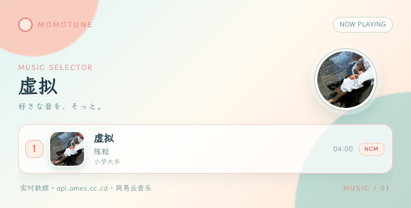

# MomoTune

<p align="center">
  <a href="https://github.com/Xinzhus/MomoTune"></a>
</p>

<h1 align="center">MomoTune</h1>
<h4 align="center">✨ GsCore 向け・网易云／酷狗対応の二次元音楽リクエストプラグイン ✨</h4>

<div align="center">
  <a href="https://github.com/Genshin-bots/gsuid_core">GsCore</a> &nbsp;·&nbsp;
  <a href="https://docs.sayu-bot.com/">公式ドキュメント</a> &nbsp;·&nbsp;
  <a href="./README.zh-CN.md">简体中文</a> &nbsp;·&nbsp;
  <a href="https://github.com/Xinzhus/MomoTune/issues">Issue</a>
</div>

<br/>

## 丨インストール前の注意

> **MomoTune は [GsCore（gsuid_core）](https://github.com/Genshin-bots/gsuid_core) の拡張プラグインです。先に GsCore を起動できる状態にしてください。**
>
> NoneBot2 / HoshinoBot / ZeroBot / Yunzai / Koishi / AstrBot など、GsCore に接続された上流 Bot で利用できます。
>
> 初回インストールまたは更新後は、Core を再起動して変更を反映してください。

本プラグインは独自の WebUI を持ちません。検索結果・再生情報はチャットへ画像カードとして送信します。

> [!NOTE]
> 音源の検索・ジャケット・再生 URL は設定したバックエンドから取得します。配信地域、著作権、API の利用規約を確認したうえで利用してください。

<br/>

## 丨インストール方法

### 方法一（推奨）：GsCore からインストール

GsCore に接続されたチャットで次のコマンドを送信します。

```text
core安装插件MomoTune
core重启
```

依存関係は `pyproject.toml` に記載しています。自動依存インストールを無効にしている Core では、同じ Python 環境で次を実行してください。

```bash
pip install "httpx>=0.27.0" "pytakumi>=0.1.0"
```

### 方法二：手動で clone

```bash
cd /path/to/gsuid_core/gsuid_core/plugins
git clone https://github.com/Xinzhus/MomoTune.git
```

その後、Core を再起動します。

<br/>

## 丨クイックスタート

| コマンド | 内容 | 備考 |
| :--- | :--- | :--- |
| `点歌 晴天` | 网易云で検索して候補を表示 | `唱歌` / `来一首` も利用可 |
| `酷狗点歌 花海` | 酷狗で検索して候補を表示 | `酷狗唱歌` / `酷狗来一首` も利用可 |
| `1` ～ `10` | 候補リストから番号を選択 | 選択状態は 5 分間有効 |
| `点歌 421423808` | 网易云の曲 ID を直接再生 | 数字 ID のみ対応 |

検索結果が複数ある場合は、カードを確認して番号を返信してください。選択された曲の情報カードを送信したあと、利用可能な音声を `record` として送信します。

<br/>

## 丨主な機能

- **2 つの音源**：网易云音乐と酷狗音乐を同じ操作感で検索・再生。
- **候補選択**：複数結果を番号付きカードで表示し、ユーザー・グループ単位で選択状態を分離。
- **直接 ID 再生**：网易云の数字曲 ID を指定して検索を省略。
- **ジャケット付きカード**：曲のジャケット、曲名、アーティスト、アルバム、時間、音源を一枚にまとめて描画。
- **二次元テイスト**：`MomoTuneWenKai` フォント、青緑・クリーム・珊瑚色の配色、円形レコード演出。
- **AI 連携**：`to_ai` を登録しているため、GsCore AI から「この曲を探して」「网易云で再生して」のような自然文でも呼び出せます。
- **再生制限への配慮**：API が URL を返さない場合は、理由をチャットへ返して別の曲を試せます。

<details>
<summary>リアルタイム描画のサンプル：网易云「虚拟」</summary>

<p align="center">
  
</p>

この画像は `https://api.ames.cc.cd` の `cloudsearch` API から取得した最初の結果（陈粒「虚拟」）を、その場で取得・描画したものです。右上の円形レコードにも同じ曲のジャケットを使用しています。
</details>

<br/>

## 丨バックエンドと設定

設定は GsCore WebConsole の **MomoTune** から変更できます。ファイルを直接編集する必要はありません。

| 設定キー | デフォルト | 説明 |
| :--- | :--- | :--- |
| `ncm_api_base` | `https://api.ames.cc.cd` | 网易云互換 API。`/cloudsearch`、`/song/detail`、`/song/url/v1` を使用 |
| `ncm_kugou_api_base` | `http://127.0.0.1:3040` | 酷狗互換 API。`/search`、`/song/url` を使用 |
| `ncm_search_limit` | `10` | 1 回の検索で表示する最大件数（1～30） |
| `ncm_quality` | `exhigh` | 网易云の音質。酷狗には自動変換 |
| `ncm_cookie` | 空 | 网易云 API 用 Cookie（必要な場合のみ） |
| `ncm_kugou_cookie` | 空 | 酷狗 API 用 Cookie（必要な場合のみ） |

Cookie は設定ファイルやスクリーンショットに書き込まないでください。共有サーバーでは WebConsole の秘密設定として管理し、漏えいした場合は速やかに無効化してください。

<br/>

## 丨描画仕様

1. 検索結果の `picUrl` を取得し、カード内へ安全な data URI として埋め込みます。
2. 先頭の曲のジャケットを円形に切り抜き、リングとセンターホールを重ねてレコード風に描画します。
3. 曲ごとの一覧カードでは、同じジャケットを角丸カバーとして表示します。
4. ジャケットを取得できない場合は、音符入りのローカルプレースホルダーへフォールバックします。
5. フォントはリポジトリ内の `resources/fonts/LXGWWenKai-Regular.ttf` を `MomoTuneWenKai` として登録します。システムのデフォルトフォントには依存しません。
6. `ICON.png` は提供されたイラストをアンチエイリアス付きの円形に切り抜いたプラグインアイコンです。

<br/>

## 丨よくある問題

| 症状 | 確認ポイント |
| :--- | :--- |
| 検索結果が空 | API の URL、ネットワーク、キーワード、バックエンドのログを確認 |
| 「再生 URL がない」と表示 | 著作権・地域制限の可能性。別の曲、音源、Cookie を試す |
| カバーがプレースホルダー | `picUrl` へのアクセス、HTTPS 証明書、API の画像 URL を確認 |
| 画像描画に失敗 | `pytakumi` が Core と同じ環境にあるか確認し、Core を再起動 |
| 番号を返信しても反応しない | 同じ会話で検索したか、5 分以内か、番号が範囲内か確認 |

<br/>

## 丨プロジェクト構成

本体の構成は GsCore のネストプラグイン方式に合わせています。

```text
MomoTune/
├── MomoTune/                 # GsCore プラグイン本体
│   ├── momotune_music/       # 検索・選択・再生・描画
│   ├── momotune_config/      # WebConsole 設定
│   └── __init__.py
├── templates/search_list.html
├── preview/virtual-api-render.png
├── ICON.png
├── resources/fonts/
├── pyproject.toml
└── README.md
```

<br/>

## 丨謝辞・ライセンス

- [GsCore / gsuid_core](https://github.com/Genshin-bots/gsuid_core)：プラグイン基盤とメッセージ送受信。
- [pytakumi](https://github.com/KimigaiiWuyi/pytakumi)：HTML カード描画。
- 网易云音乐・酷狗音乐互換 API：検索、ジャケット、再生情報の提供。

本プロジェクトは学習・交流目的で公開しています。音源の利用と配信に関する責任は利用者が負うものとします。

[GNU General Public License v3.0](https://github.com/Xinzhus/MomoTune/blob/main/LICENSE) で公開しています。

---

📘 [简体中文文档](./README.zh-CN.md)
